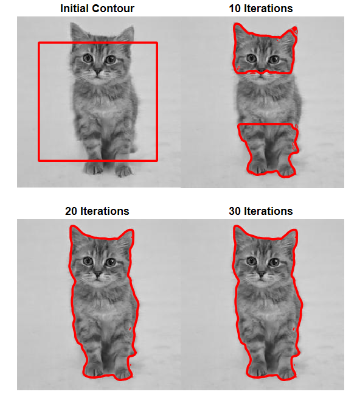

# WHRSPF
Active Contour Driven by Weighted Hybrid Signed Pressure Force for Image Segmentation

WHRSPF was my project in the course Computer Vision at Hanoi University of Science and Technology. Images were segmented using Active Contour Driven by Weighted Hybrid Signed Pressure Force, based on [this work](https://github.com/fangchj2002/WHRSPF). 

*Please give me a ⭐ if you find it useful.*

  

